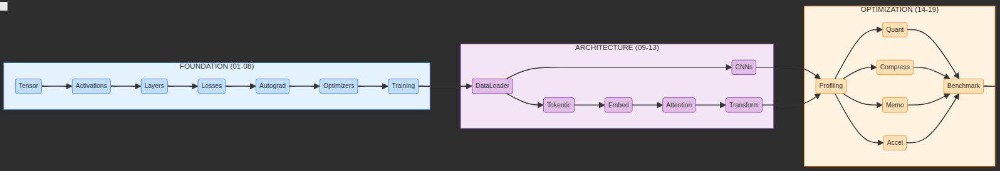

<div align="center">

# 🔥 Immi-Torch

**A minimal deep learning framework built from scratch**

[](https://www.python.org/downloads/)
[](https://opensource.org/licenses/MIT)
[](https://mlsysbook.ai/tinytorch/)
[](https://github.com/ashwin-r11/Immi-Torch/actions/workflows/ci.yml)

*"Immi" (Tamil: இம்மி) — the smallest primitive measure (1/2,150,400)*

[Big Picture](#-the-big-picture) • [Tiers](#-three-tiers) • [Milestones](#-milestones) • [Learning Paths](#-learning-paths)

</div>

---

## 🎯 What is this?

I'm building a **stripped-down, primitive implementation of PyTorch** from scratch for educational purposes. No magic, no black boxes—just pure understanding of how deep learning frameworks actually work.

Following the [TinyTorch](https://mlsysbook.ai/tinytorch/) curriculum from the ML Systems Book by Prof. Vijay Janapa Reddi (Harvard University).

> *"What I cannot create, I do not understand."* — Richard Feynman

---

## 🗺️ The Big Picture

**20 modules. Three tiers. One complete ML system.**

<div align="center">


*TinyTorch Module Flow: Foundation (blue) → Architecture (purple) → Optimization (orange)*
</div>

```
┌─────────────────────────────────────────────────────────────────────────────┐
│                        OPTIMIZATION (14-19) 🟠                              │
│   ┌──────────┐ ┌──────┐ ┌──────────┐ ┌──────┐ ┌───────┐ ┌───────────┐       │
│   │ Profiling│ │Quant │ │ Compress │ │ Memo │ │ Accel │ │ Benchmark │       │
│   └──────────┘ └──────┘ └──────────┘ └──────┘ └───────┘ └───────────┘       │
├─────────────────────────────────────────────────────────────────────────────┤
│                        ARCHITECTURE (09-13) 🟣                              │
│   ┌────────────┐    ┌──────┐                                                │
│   │ DataLoader │    │ CNNs │ ← Vision Track                                 │
│   └────────────┘    └──────┘                                                │
│         │           ┌───────────┐ ┌───────┐ ┌───────────┐ ┌─────────────┐   │
│         └──────────→│ Tokentic  │ │ Embed │ │ Attention │ │ Transformer │   │
│                     └───────────┘ └───────┘ └───────────┘ └─────────────┘   │
│                                   ↑ Language Track                          │
├─────────────────────────────────────────────────────────────────────────────┤
│                        FOUNDATION (01-08) 🔵                                │
│   ┌────────┐ ┌─────────────┐ ┌────────┐ ┌────────┐                          │
│   │ Tensor │→│ Activations │→│ Layers │→│ Losses │                          │
│   └────────┘ └─────────────┘ └────────┘ └────────┘                          │
│        ↓                                 ↓                                  │
│   ┌──────────┐ ┌─────────────┐ ┌──────────┐                                 │
│   │ Autograd │→│  Optimizers │→│ Training │                                 │
│   └──────────┘ └─────────────┘ └──────────┘                                 │
└─────────────────────────────────────────────────────────────────────────────┘
                                   
```

---

## 🎨 Three Tiers

### 🔵 Tier 1: Foundation (Modules 01-08)
> *Build the core machinery*

| # | Module | What it does | Status |
|---|--------|--------------|--------|
| 01 | **Tensor** | Data structure - holds all your numbers | ✅pushed jan5 |
| 02 | **Activations** | Non-linearity - ReLU, Sigmoid, Tanh | ⏳ |
| 03 | **Layers** | Parameterized transformations | ⏳ |
| 04 | **Losses** | Measure prediction error | ⏳ |
| 05 | **DataLoader** | Efficient data batching | ⏳ |
| 06 | **Autograd** | Automatic gradient computation | ⏳ |
| 07 | **Optimizers** | SGD, Adam, RMSprop | ⏳ |
| 08 | **Training** | Complete training loop | ⏳ |

### 🟣 Tier 2: Architecture (Modules 09-13)
> *Apply foundation to real problems*

| # | Module | What it does | Track |
|---|--------|--------------|-------|
| 09 | **DataLoader+** | Advanced data pipelines | Both |
| 10 | **CNNs** | Convolutions for images | 👁️ Vision |
| 11 | **Tokenization** | Text → tokens | 📝 Language |
| 12 | **Embeddings** | Tokens → vectors | 📝 Language |
| 13 | **Attention** | Self-attention mechanism | 📝 Language |
| 14 | **Transformers** | GPT architecture | 📝 Language |

### 🟠 Tier 3: Optimization (Modules 14-19)
> *Make it production-ready*

| # | Module | What it does |
|---|--------|--------------|
| 15 | **Profiling** | Find bottlenecks |
| 16 | **Quantization** | Reduce precision |
| 17 | **Compression** | Smaller models |
| 18 | **Memoization** | Cache computations |
| 19 | **Acceleration** | Hardware optimization |
| 20 | **Benchmarking** | MLPerf-style metrics |

---

## 🏆 Milestones

Historical achievements I'll unlock by recreating 70 years of ML evolution:

| Milestone | Year | Achievement | Modules Required |
|-----------|------|-------------|------------------|
| 🧠 **Perceptron** | 1957 | First learning algorithm (Rosenblatt) | 01-04 |
| ⚡ **XOR** | 1969 | MLP solves non-linear problems | 01-08 |
| ✍️ **MLP** | 1986 | Handwritten digit recognition | 01-08 |
| 👁️ **CNN** | 1998 | LeNet-5 image classification | 01-09 |
| 🤖 **Transformer** | 2017 | "Attention Is All You Need" | 01-13 |
| 🏁 **MLPerf** | 2018 | Production-speed benchmarks | 01-19 |

### What I'll Have at Each Checkpoint

| Modules | Outcome | Historical Context |
|---------|---------|-------------------|
| 01-04 | Working Perceptron classifier | Rosenblatt 1957 |
| 01-08 | MLP solving XOR + complete training pipeline | AI Winter breakthrough 1969→1986 |
| 01-09 | CNN with convolutions and pooling | LeNet-5 (1998) |
| 01-13 | GPT model with autoregressive generation | "Attention Is All You Need" (2017) |
| 01-19 | Optimized, quantized, accelerated system | Production ML today |
| 01-20 | MLPerf-style benchmarking submission | Torch Olympics |


---

## 📁 Project Structure

```
Immi-Torch/
├── immi_torch/
│   ├── __init__.py                    # Main package exports
│   │
│   ├── tier1_foundation/              # 🔵 Core ML machinery (01-08)
│   │   ├── tensor.py                  # 01: Multidimensional arrays
│   │   ├── activations.py             # 02: ReLU, Sigmoid, Tanh
│   │   ├── layers.py                  # 03: Linear, Module base
│   │   ├── losses.py                  # 04: MSE, CrossEntropy
│   │   ├── data.py                    # 05: DataLoader, Dataset
│   │   ├── autograd.py                # 06: Automatic differentiation
│   │   ├── optim.py                   # 07: SGD, Adam, RMSprop
│   │   └── train.py                   # 08: Training loop
│   │
│   ├── tier2_architecture/            # 🟣 Vision & Language (09-14)
│   │   ├── cnn.py                     # 10: Conv2d, Pooling
│   │   ├── tokenizer.py               # 11: Text tokenization
│   │   ├── embeddings.py              # 12: Token embeddings
│   │   ├── attention.py               # 13: Self-attention
│   │   └── transformer.py             # 14: GPT architecture
│   │
│   └── tier3_optimization/            # 🟠 Production-ready (15-20)
│       ├── profiling.py               # 15: Find bottlenecks
│       ├── quantization.py            # 16: Reduce precision
│       ├── compression.py             # 17: Pruning, distillation
│       ├── memoization.py             # 18: Cache computations
│       ├── acceleration.py            # 19: JIT, op fusion
│       └── benchmarking.py            # 20: MLPerf metrics
│
├── tests/                             # Test suite
├── milestones/                        # Historical achievements (70 years of ML)
│   ├── 01_perceptron.py               # 🧠 1957 - First neural network
│   ├── 02_xor.py                      # ⚡ 1969 - Non-linear learning
│   ├── 03_mnist_mlp.py                # ✍️ 1986 - Handwritten digits
│   ├── 04_cnn_lenet.py                # 👁️ 1998 - LeNet-5 vision
│   ├── 05_transformer.py              # 🤖 2017 - Attention mechanism
│   └── 06_mlperf.py                   # 🏁 2018 - Production benchmarks
├── examples/                          # Usage examples
├── docs/                              # Documentation
└── tier1_plans.md                     # Detailed Tier 1 roadmap
```

---

## 🚀 Getting Started

```bash
# Clone the repository
git clone https://github.com/ashwin-r11/Immi-Torch.git
cd Immi-Torch

# Install in development mode
pip install -e ".[dev]"

# Run tests
pytest tests/
```

### Quick Example

```python
from immi_torch import Tensor, Linear, ReLU, MSELoss, SGD

# Create a simple model
model = Linear(10, 1)
loss_fn = MSELoss()
optimizer = SGD(model.parameters(), lr=0.01)

# Training step
x = Tensor.randn(32, 10)
y = Tensor.randn(32, 1)

pred = ReLU()(model(x))
loss = loss_fn(pred, y)
loss.backward()
optimizer.step()
```

---

## 💪 Expect to Struggle (That's the Design)

> Getting stuck is not a bug—it's a feature.

TinyTorch uses **productive struggle** as a teaching tool. The frustration you feel is your brain rewiring to understand ML systems at a deeper level.

**When stuck:**
- Run tests early and often
- Explain the problem to a rubber duck
- Ask for help after 30+ minutes on a single bug

---

## 📚 Resources

- **Curriculum**: [TinyTorch - ML Systems Book](https://mlsysbook.ai/tinytorch/)
- **Theory**: [Deep Learning Book](https://www.deeplearningbook.org/) by Goodfellow, Bengio & Courville
- **Big Picture**: [Module Overview](https://mlsysbook.ai/tinytorch/big-picture.html)
- **Getting Started**: [Quick Start Guide](https://mlsysbook.ai/tinytorch/getting-started.html)
- **Reference**: [PyTorch Documentation](https://pytorch.org/docs/)

---

## 📄 License

MIT License - see [LICENSE](LICENSE) for details.

---

<div align="center">

**The North Star** 🌟

*By module 13, I'll have a complete GPT model generating text—built from raw Python.*

*By module 20, I'll benchmark my entire framework with MLPerf-style submissions.*

*Every tensor operation. Every gradient calculation. Every optimization trick.*

**I wrote it.**

</div>
